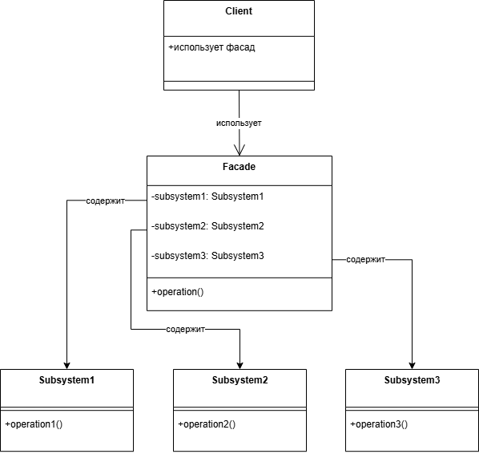

# Билет по ООП на Python

## 1. Сериализация и десериализация. Файлы JSON

### Определение
**Сериализация** — процесс преобразования объектов Python в поток байтов или строку (обычно в формат JSON) для хранения или передачи.

**Десериализация** — обратный процесс восстановления объектов Python из строки или потока байтов.

### Модуль `json` в Python
Модуль `json` предоставляет методы для работы с JSON:
- `json.dump()` — сериализация в файл
- `json.dumps()` — сериализация в строку
- `json.load()` — десериализация из файла
- `json.loads()` — десериализация из строки

### Примеры кода

#### Базовый пример
```python
import json

# Данные для сериализации
data = {
    "name": "Аня",
    "age": 19,
    "is_student": True,
    "courses": ["Python", "ООП", "Алгоритмы"],
    "address": {
        "city": "Москва",
        "street": "Волгоградский проспект"
    }
}

# Сериализация в строку
json_string = json.dumps(data, ensure_ascii=False, indent=2)
print("Сериализованная строка:")
print(json_string)

# Десериализация из строки
decoded_data = json.loads(json_string)
print("\nДесериализованные данные:")
print(f"Имя: {decoded_data['name']}")
print(f"Курсы: {', '.join(decoded_data['courses'])}")

# Сериализация в файл
with open('data.json', 'w', encoding='utf-8') as f:
    json.dump(data, f, ensure_ascii=False, indent=2)

# Десериализация из файла
with open('data.json', 'r', encoding='utf-8') as f:
    loaded_data = json.load(f)
    print("\nДанные из файла:")
    print(loaded_data)
```

#### Результат

В терминале

```
Сериализованная строка:
{
  "name": "Аня",
  "age": 19,
  "is_student": true,
  "courses": [
    "Python",
    "ООП",
    "Алгоритмы"
  ],
  "address": {
    "city": "Москва",
    "street": "Волгоградский проспект"
  }
}

Десериализованные данные:
Имя: Аня
Курсы: Python, ООП, Алгоритмы

Данные из файла:
{'name': 'Аня', 'age': 19, 'is_student': True, 'courses': ['Python', 'ООП', 'Алгоритмы'], 'address': {'city': 'Москва', 'street': 'Волгоградский проспект'}}
```

Также будет создан файл data.json со следующим содержимым:

```
{
  "name": "Аня",
  "age": 19,
  "is_student": true,
  "courses": [
    "Python",
    "ООП",
    "Алгоритмы"
  ],
  "address": {
    "city": "Москва",
    "street": "Волгоградский проспект"
  }
}
```
#### Проект

В папке my_project находится один из моих мини-проектов - "Менеджер", который детально раскрывает данную тему. При желании можно посмотреть.

---

## 2. [Тема отсутствует]

---

## 3. [Тема отсутствует]

---

# Билет по ООП на Python

## 1. Сериализация и десериализация. Файлы JSON

### Определение
**Сериализация** — процесс преобразования объектов Python в поток байтов или строку (обычно в формат JSON) для хранения или передачи.

**Десериализация** — обратный процесс восстановления объектов Python из строки или потока байтов.

### Модуль `json` в Python
Модуль `json` предоставляет методы для работы с JSON:
- `json.dump()` — сериализация в файл
- `json.dumps()` — сериализация в строку
- `json.load()` — десериализация из файла
- `json.loads()` — десериализация из строки

### Базовый пример кода
```python
import json

# Данные для сериализации
data = {
    "name": "Иван",
    "age": 30,
    "is_student": False,
    "courses": ["Python", "ООП", "Алгоритмы"],
    "address": {
        "city": "Москва",
        "street": "Ленина"
    }
}

# Сериализация в строку
json_string = json.dumps(data, ensure_ascii=False, indent=2)
print("Сериализованная строка:")
print(json_string)

# Десериализация из строки
decoded_data = json.loads(json_string)
print("\nДесериализованные данные:")
print(f"Имя: {decoded_data['name']}")
print(f"Курсы: {', '.join(decoded_data['courses'])}")
```

### Работа с файлами
```python
import json

# Сериализация в файл
with open('data.json', 'w', encoding='utf-8') as f:
    json.dump(data, f, ensure_ascii=False, indent=2)

# Десериализация из файла
with open('data.json', 'r', encoding='utf-8') as f:
    loaded_data = json.load(f)
    print("\nДанные из файла:")
    print(loaded_data)
```

Небольшой проект, раскрывающий данную тему, находится в папке `task1`

---

## 2. [Тема отсутствует]

---

## 3. [Тема отсутствует]

---

## 4. Структурные паттерны проектирования. Фасад (Facade)

### Определение и концепция
**Фасад (Facade)** — это структурный паттерн проектирования, который предоставляет унифицированный, упрощенный интерфейс к сложной системе классов, библиотеке или фреймворку. Паттерн скрывает внутреннюю сложность системы, предоставляя клиенту только необходимые методы.

### Основные цели
1. **Упрощение интерфейса** — предоставление простого интерфейса для сложной подсистемы
2. **Снижение связанности** — уменьшение зависимостей между клиентом и компонентами системы
3. **Инкапсуляция сложности** — сокрытие деталей реализации подсистемы
4. **Организация кода** — создание четкой точки входа в сложную систему

### Структура паттерна



### Компоненты паттерна

#### 1. **Фасад (Facade)**
- Основной класс, предоставляющий упрощенный интерфейс
- Делегирует запросы клиента соответствующим объектам подсистемы
- Может добавлять дополнительную логику между запросом клиента и вызовами подсистемы
- **Не заменяет** подсистему, а только упрощает доступ к ней

#### 2. **Дополнительный фасад (Additional Facade)**
- Может быть создан для предотвращения "загрязнения" основного фасада
- Выносит часть функциональности в отдельные классы
- Позволяет разделить фасад на более мелкие и специализированные интерфейсы

#### 3. **Сложная подсистема (Complex Subsystem)**
- Состоит из множества разнородных объектов
- Для работы подсистемы требуются глубокие знания о ее внутреннем устройстве
- Классы подсистемы не знают о существовании фасада

#### 4. **Клиент (Client)**
- Использует фасад вместо прямого взаимодействия с объектами подсистемы
- Получает простой и понятный интерфейс
- Может продолжать использовать объекты подсистемы напрямую, если это необходимо

### Принцип работы
1. Клиент обращается к фасаду с запросом
2. Фасад перенаправляет запрос соответствующим объектам подсистемы
3. Объекты подсистемы выполняют работу
4. Фасад агрегирует результаты и возвращает их клиенту
5. Клиент получает простой ответ без знания о внутренней сложности

### Преимущества

#### 1. **Изоляция клиента от сложности**
```python
# Без фасада
subsystem_a = SubsystemA()
subsystem_b = SubsystemB()
subsystem_c = SubsystemC()

# Клиент должен знать последовательность вызовов
result1 = subsystem_a.initialize()
result2 = subsystem_b.setup(result1)
result3 = subsystem_c.configure(result2)
final_result = subsystem_a.finalize(result3)

# С фасадом
facade = Facade()
final_result = facade.simple_operation()  # Вся сложность скрыта
```

#### 2. **Снижение связанности**
- Клиент зависит только от фасада, а не от всех классов подсистемы
- Изменения в подсистеме минимально затрагивают клиентский код
- Упрощается тестирование и поддержка

#### 3. **Улучшение читаемости и поддерживаемости**
- Код клиента становится чище и понятнее
- Логика работы с подсистемой централизована в одном месте
- Упрощается рефакторинг и модификация системы

### Недостатки

#### 1. **Риск создания "божественного объекта" (God Object)**
- Фасад может стать слишком большим и сложным
- Решение: создание дополнительных фасадов

#### 2. **Дополнительный уровень абстракции**
- Увеличивает сложность архитектуры
- Может замедлить выполнение (незначительно)

### Когда использовать паттерн Фасад

#### 1. **Для упрощения сложной системы**
- Когда система имеет много взаимосвязанных классов
- Когда клиентам требуется только часть функциональности системы

#### 2. **Для разделения подсистем**
- Когда нужно разбить систему на слои
- Для создания четких точек входа в каждый слой

#### 3. **При интеграции сторонних библиотек**
- Для создания удобного интерфейса к сложным библиотекам
- Для изоляции зависимостей от стороннего кода

#### 4. **В легаси-системах**
- Для модернизации устаревших систем без полной переработки
- Для создания современного интерфейса к старому коду

### Отношение с другими паттернами

#### **Фасад vs Адаптер (Adapter)**
- **Фасад** упрощает интерфейс, но не изменяет его
- **Адаптер** изменяет интерфейс для совместимости с другим кодом

#### **Фасад vs Посредник (Mediator)**
- **Фасад** предоставляет интерфейс к подсистеме
- **Посредник** централизует коммуникацию между компонентами

#### **Фасад vs Одиночка (Singleton)**
- Фасад часто реализуется как одиночка, но это не обязательно
- Можно иметь несколько экземпляров фасада с разной конфигурацией

### Практические аспекты реализации

#### 1. **Интерфейс фасада должен быть минимальным**
```python
class GoodFacade:
    # Хорошо: небольшой набор методов
    def process_order(self, order_data): ...
    def get_status(self, order_id): ...
    def cancel_order(self, order_id): ...

class BadFacade:
    # Плохо: слишком много методов
    def validate_order(self, order): ...
    def calculate_price(self, order): ...
    def check_inventory(self, items): ...
    def process_payment(self, payment): ...
    # ... и еще 20 методов
```

#### 2. **Фасад не должен ограничивать доступ к подсистеме**
```python
class FlexibleFacade:
    def __init__(self):
        self.subsystem = ComplexSubsystem()

    def simple_operation(self):
        # Предоставляет упрощенный интерфейс
        return self.subsystem.do_complex_thing()

    @property
    def subsystem_access(self):
        # Но также позволяет доступ к подсистеме
        return self.subsystem
```

### Базовый пример кода
```python
# Сложные подсистемы
class SubsystemA:
    def operation_a1(self):
        return "SubsystemA: Готов!"

    def operation_a2(self):
        return "SubsystemA: Выполняю!"

class SubsystemB:
    def operation_b1(self):
        return "SubsystemB: Готов!"

    def operation_b2(self):
        return "SubsystemB: Выполняю!"

class SubsystemC:
    def operation_c1(self):
        return "SubsystemC: Готов!"

    def operation_c2(self):
        return "SubsystemC: Выполняю!"

# Фасад
class Facade:
    def __init__(self):
        self.subsystem_a = SubsystemA()
        self.subsystem_b = SubsystemB()
        self.subsystem_c = SubsystemC()

    def operation(self):
        """Простой интерфейс для клиента"""
        results = []
        results.append(self.subsystem_a.operation_a1())
        results.append(self.subsystem_b.operation_b1())
        results.append(self.subsystem_c.operation_c1())
        results.append(self.subsystem_a.operation_a2())
        results.append(self.subsystem_b.operation_b2())
        results.append(self.subsystem_c.operation_c2())
        return "\n".join(results)

# Клиентский код
def client_code(facade: Facade):
    print(facade.operation())

# Использование
facade = Facade()
client_code(facade)
```

#### Продвинутый пример

Проект, детально раскрывающий данную тему, находится в папке task4.